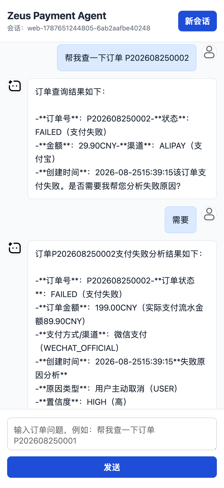
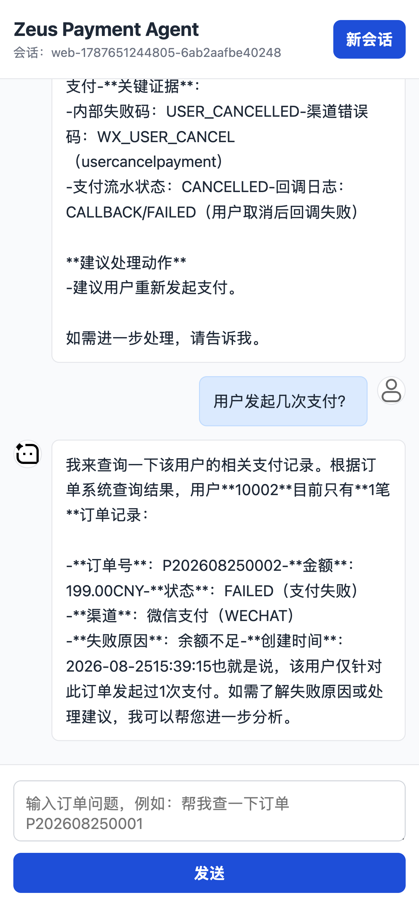

# Zeus Payment Agent

Zeus Payment Agent 是一个面向支付排障场景的智能 Agent 项目，目标是让用户通过自然语言完成订单查询、支付日志排查、失败原因分析、知识库问答、异常调查和日报生成。

当前阶段先实现最小闭环：用户输入自然语言问题，LLM 判断是否需要查询订单，并通过 ToolCalling 调用订单查询工具，从 MySQL 读取订单数据后生成中文回答。

## 项目效果

<table>
  <tr>
    <td></td>
    <td></td>
  </tr>
</table>

## 功能能力

### 已实现

- 自然语言查询订单。
- LLM 自动调用订单查询 Tool。
- 基于 MySQL 查询订单数据。
- Redis 保存多轮对话上下文。
- 支持连续对话中的上下文引用，例如“这个订单”“上一笔”。
- Web 聊天页面。
- SSE 流式输出。
- 查询过程中的思考/查询进度提示。
- 打字节奏输出，提升对话自然度。
- 用户和 AI 聊天气泡头像。
- 支付失败原因自动分析基础能力。
- V5 知识库文档素材。

### 规划中

- 查询支付日志。
- 完善支付失败原因分析规则和证据链。
- 接入知识库 RAG 检索和回答增强。
- 自动生成支付日报。
- 发现异常后自主继续调查。
- 跨订单、支付、日志、知识库多个 Agent 协作。
- 加入 Eval、Tracing、权限和审计能力。

## 技术栈

### 后端

| 技术 | 版本 | 用途 |
| --- | --- | --- |
| Java | 17 | 后端运行环境 |
| Spring Boot | 4.0.9 | 应用主框架 |
| Spring Web MVC | 4.0.9 | REST API、SSE 接口、静态资源访问 |
| Spring AI | 2.0.0 | LLM 接入、ChatClient、ToolCalling |
| DeepSeek | deepseek-v4-flash | 当前使用的大模型 |
| OpenAI Compatible API | - | 通过 OpenAI 兼容协议接入 DeepSeek |
| MyBatis Spring Boot Starter | 4.0.0 | 订单等结构化数据访问 |
| MyBatis | 3.5.19 | SQL Mapper 和结果映射 |
| MySQL Connector/J | 9.7.0 | MySQL JDBC 驱动 |
| Redis / Spring Data Redis | 4.0.9 | 多轮对话上下文存储 |
| Spring Security | 4.0.9 | 后续接口鉴权、权限控制 |
| Actuator | 4.0.9 | 健康检查、运行状态、监控端点 |
| Micrometer | 1.16.7 | 指标采集 |
| Micrometer Tracing | 1.6.7 | 链路追踪基础能力 |
| OpenTelemetry | 4.0.9 | 后续 Trace 导出和观测 |
| Quartz | 4.0.9 | 后续日报、巡检、调查任务调度 |
| Flyway | 11.14.1 | 后续数据库结构版本管理 |
| Lombok | 1.18.46 | 简化 Java 样板代码 |
| Maven | - | 依赖管理和项目构建 |

### 前端

| 技术 | 版本 | 用途 |
| --- | --- | --- |
| HTML | HTML5 | 页面结构 |
| CSS | CSS3 | 页面布局、聊天气泡、头像和动效 |
| JavaScript | ES6+ | 前端交互和流式渲染 |
| Server-Sent Events | - | 服务端流式输出 |
| Fetch ReadableStream | - | 前端读取流式响应 |
| localStorage | - | 保存当前会话 ID |

### AI 工程

| 能力 | 版本 / 基础 | 用途 |
| --- | --- | --- |
| LLM 对话 | 2.0.0 | 自然语言理解和回答生成 |
| ToolCalling | 2.0.0 | 让模型调用订单查询等业务工具 |
| Conversation Memory | - | 保存多轮对话上下文 |
| Prompt 编排 | 2.0.0 | 控制 Agent 角色、回答边界和工具调用策略 |
| RAG | Spring AI Vector Store Advisor 2.0.0 | 后续接入知识库检索增强 |
| Multi-Agent | - | 后续拆分订单、支付、日志、知识库等专业 Agent |
| Eval | Spring AI Test 2.0.0 | 后续评估回答质量和 ToolCalling 准确性 |
| Tracing | - | 后续追踪 LLM 调用、Tool 调用和调查链路 |

## 技术路线

项目采用“先工具化，再 Agent 化”的演进方式。

早期阶段先把订单、支付、日志、知识库等能力封装成明确的 Tool，让 LLM 可以稳定调用。这样可以先保证查询和分析结果来自真实业务数据，而不是完全依赖模型生成。

中期阶段引入支付日志、失败码规则、知识库 RAG 和日报任务，让 Agent 具备更完整的支付排障上下文，能够从“查订单”升级为“解释问题”和“给出处理建议”。

后期阶段拆分多个专业 Agent，例如订单 Agent、支付 Agent、日志 Agent、知识库 Agent、报告 Agent，再由协调 Agent 组织调查流程，实现跨系统、跨数据源的自动排障。

## 架构方向

整体架构分为五层：

- 交互层：Web 聊天页面、HTTP API、流式输出。
- Agent 层：LLM 对话、Prompt 编排、ToolCalling、上下文记忆。
- 工具层：订单查询 Tool、支付日志 Tool、知识库检索 Tool、日报生成 Tool、异常调查 Tool。
- 数据层：MySQL、Redis，后续可扩展向量库和日志检索系统。
- 治理层：权限、审计、Tracing、Eval、监控指标。

当前项目已经打通交互层、Agent 层、订单工具层和基础数据层，数据访问层使用 MyBatis。

## 版本规划

### V1 自然语言查询订单

用户可以用自然语言描述查询需求，不需要记住固定接口或 SQL。

### V2 LLM 调订单查询 Tool

LLM 根据用户问题自动判断是否需要查询订单，并选择合适的订单查询工具。

### V3 查询支付日志

接入支付链路日志，支持围绕订单号、支付流水号、渠道和时间范围查询支付过程。

### V4 自动分析支付失败原因

结合订单状态、渠道返回码、失败码、失败原因和支付日志，自动归因支付失败原因，并输出处理建议。

### V5 接入知识库 RAG

接入支付渠道文档、错误码说明、内部 SOP 和历史故障复盘，让回答能够引用知识库上下文。

### V6 自动做日报

自动汇总支付订单量、成功率、失败率、渠道分布、异常 TopN 和重点问题，生成支付日报。

### V7 发现异常后自主继续调查

当发现失败率突增、渠道异常、错误码集中爆发等问题时，Agent 可以继续追查关联订单、日志和知识库，而不是只回答当前问题。

### V8 多 Agent 协作

拆分订单、支付、日志、知识库、报告等多个专业 Agent，通过协调 Agent 统一编排复杂排障任务。

### V9 Eval / Tracing / 权限

加入回答质量评估、Tool 调用评估、链路追踪、权限控制、敏感字段脱敏和审计日志，使项目具备生产化基础。

## 当前状态

当前项目处于 V1-V2 阶段，并已加入 V4 支付失败分析的基础 ToolCalling 能力，同时准备了 V5 知识库文档素材。现阶段已经具备简单对话、流式输出、上下文记忆、订单查询和支付失败分析能力。

后续重点是补齐支付日志查询和失败原因分析规则，让 Agent 从“查数据”升级为“辅助排障”。
