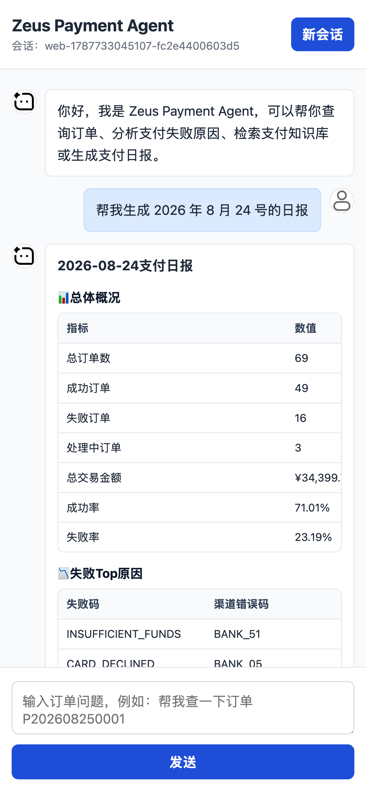
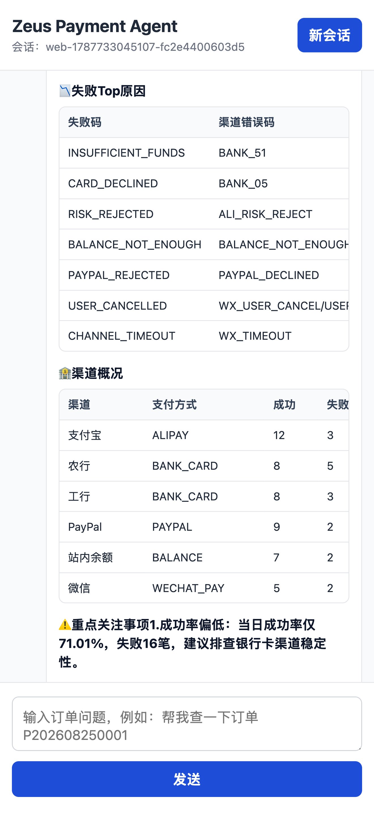
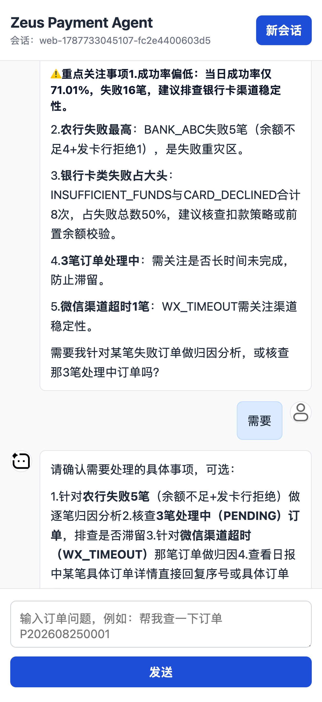
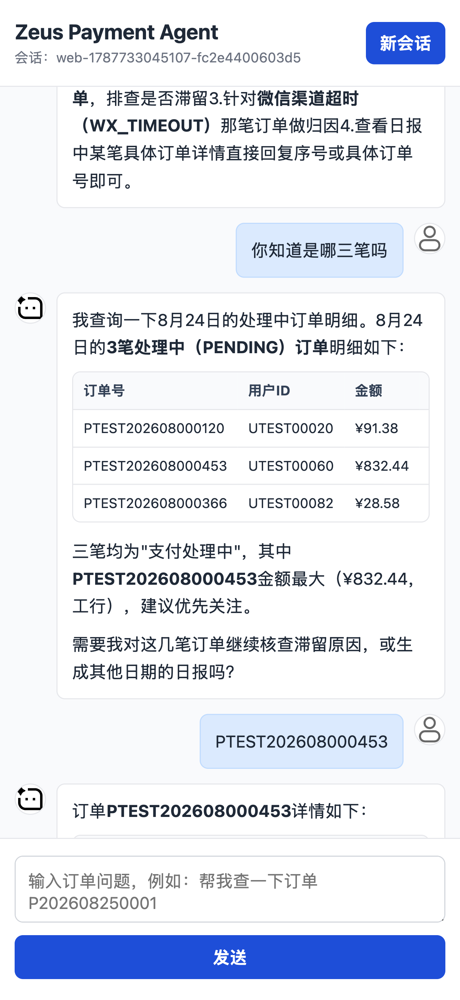

# Zeus Payment Agent

Zeus Payment Agent 是一个面向支付排障场景的智能 Agent 项目，目标是让用户通过自然语言完成订单查询、支付日志排查、失败原因分析、知识库问答、异常调查和日报生成。

当前阶段先实现支付排障 Agent 的最小闭环：用户通过 Web 聊天页面发起自然语言问题，LLM 判断是否需要调用业务 Tool，并从 MySQL、Redis、Chroma 等组件中获取上下文后生成中文回答。

## 项目效果

<table>
  <tr>
    <td></td>
    <td></td>
  </tr>
  <tr>
    <td></td>
    <td></td>
  </tr>
  <tr>
    <td></td>
    <td></td>
  </tr>
</table>

## 功能能力

### 已实现

- 自然语言查询订单。
- LLM 自动调用订单查询 Tool。
- 基于 MySQL 查询订单数据。
- 支付流水独立查询 ToolCalling 能力。
- Redis 保存多轮对话上下文。
- 支持连续对话中的上下文引用，例如“这个订单”“上一笔”。
- Web 聊天页面。
- SSE 流式输出。
- 查询过程中的思考/查询进度提示。
- 打字节奏输出，提升对话自然度。
- 用户和 AI 聊天气泡头像。
- 支付失败原因自动分析基础能力。
- V5 知识库文档素材。
- V5 知识库文档切分、预览和 Chroma 手动导入管理接口。
- V5 知识库检索 ToolCalling 基础能力。
- V6 支付日报手动生成、定时生成和 ToolCalling 基础能力。
- V6 支付日报前端可视化图表。
- V7 支付异常自动调查增强能力，不包含支付日志查询。
- V7 支持渠道失败码交叉、小时窗口、用户集中度和金额区间深挖。
- Tool 调用审计基础能力，记录入参摘要、出参摘要、状态和耗时。
- 测试环境批量生成订单和支付流水数据。
- 前端支持 Markdown 加粗、行内代码和表格渲染。

### 规划中

- V3 独立支付日志查询 Tool。
- 完善支付失败原因分析规则、证据链和日志联动。
- 增强知识库 RAG 召回质量、重排和引用可信度。
- 完善支付日报趋势对比、异常解释和外部推送。
- 完善异常调查的阈值配置、异步执行、人工确认和更多业务维度。
- 跨订单、支付、日志、知识库多个 Agent 协作。
- 加入 Eval、Tracing、权限和审计能力。

## 技术栈

### 后端

<table>
  <thead>
    <tr>
      <th align="left">技术</th>
      <th align="left" width="180">版本</th>
      <th align="left">用途</th>
    </tr>
  </thead>
  <tbody>
    <tr><td>Java</td><td nowrap>17</td><td>后端运行环境</td></tr>
    <tr><td>Spring Boot</td><td nowrap>4.0.9</td><td>应用主框架</td></tr>
    <tr><td>Spring Web MVC</td><td nowrap>4.0.9</td><td>REST API、SSE 接口、静态资源访问</td></tr>
    <tr><td>Spring AI</td><td nowrap>2.0.0</td><td>LLM 接入、ChatClient、ToolCalling</td></tr>
    <tr><td>DeepSeek</td><td nowrap>deepseek-v4-flash</td><td>当前使用的大模型</td></tr>
    <tr><td>Qwen Embedding</td><td nowrap>text-embedding-v4</td><td>V5 知识库文档向量化</td></tr>
    <tr><td>OpenAI Compatible API</td><td nowrap>-</td><td>通过 OpenAI 兼容协议接入 DeepSeek</td></tr>
    <tr><td>Chroma Vector Store</td><td nowrap>2.0.0</td><td>V5 RAG 向量存储和相似度检索，当前索引为 <code>zeus/payment_agent/payment_knowledge</code></td></tr>
    <tr><td>MyBatis Spring Boot Starter</td><td nowrap>4.0.0</td><td>订单等结构化数据访问</td></tr>
    <tr><td>MyBatis</td><td nowrap>3.5.19</td><td>SQL Mapper 和结果映射</td></tr>
    <tr><td>MySQL Connector/J</td><td nowrap>9.7.0</td><td>MySQL JDBC 驱动</td></tr>
    <tr><td>Redis / Spring Data Redis</td><td nowrap>4.0.9</td><td>多轮对话上下文存储</td></tr>
    <tr><td>Spring Security</td><td nowrap>4.0.9</td><td>后续接口鉴权、权限控制</td></tr>
    <tr><td>Actuator</td><td nowrap>4.0.9</td><td>健康检查、运行状态、监控端点</td></tr>
    <tr><td>Micrometer</td><td nowrap>1.16.7</td><td>指标采集</td></tr>
    <tr><td>Micrometer Tracing</td><td nowrap>1.6.7</td><td>链路追踪基础能力</td></tr>
    <tr><td>OpenTelemetry</td><td nowrap>4.0.9</td><td>后续 Trace 导出和观测</td></tr>
    <tr><td>Quartz</td><td nowrap>4.0.9</td><td>后续日报、巡检、调查任务调度</td></tr>
    <tr><td>Flyway</td><td nowrap>11.14.1</td><td>后续数据库结构版本管理</td></tr>
    <tr><td>Lombok</td><td nowrap>1.18.46</td><td>简化 Java 样板代码</td></tr>
    <tr><td>Maven</td><td nowrap>-</td><td>依赖管理和项目构建</td></tr>
  </tbody>
</table>

### 前端

<table>
  <thead>
    <tr>
      <th align="left">技术</th>
      <th align="left" width="180">版本</th>
      <th align="left">用途</th>
    </tr>
  </thead>
  <tbody>
    <tr><td>HTML</td><td nowrap>HTML5</td><td>页面结构</td></tr>
    <tr><td>CSS</td><td nowrap>CSS3</td><td>页面布局、聊天气泡、头像和动效</td></tr>
    <tr><td>JavaScript</td><td nowrap>ES6+</td><td>前端交互和流式渲染</td></tr>
    <tr><td>Canvas</td><td nowrap>HTML5</td><td>支付日报可视化图表</td></tr>
    <tr><td>Server-Sent Events</td><td nowrap>-</td><td>服务端流式输出</td></tr>
    <tr><td>Fetch ReadableStream</td><td nowrap>-</td><td>前端读取流式响应</td></tr>
    <tr><td>localStorage</td><td nowrap>-</td><td>保存当前会话 ID</td></tr>
  </tbody>
</table>

### AI 工程

<table>
  <thead>
    <tr>
      <th align="left">能力</th>
      <th align="left" width="180">版本 / 基础</th>
      <th align="left">用途</th>
    </tr>
  </thead>
  <tbody>
    <tr><td>LLM 对话</td><td nowrap>2.0.0</td><td>自然语言理解和回答生成</td></tr>
    <tr><td>ToolCalling</td><td nowrap>2.0.0</td><td>让模型调用订单查询等业务工具</td></tr>
    <tr><td>Conversation Memory</td><td nowrap>-</td><td>保存多轮对话上下文</td></tr>
    <tr><td>Prompt 编排</td><td nowrap>2.0.0</td><td>控制 Agent 角色、回答边界和工具调用策略</td></tr>
    <tr><td>RAG</td><td nowrap>2.0.0</td><td>知识库文档切分、向量化、Chroma 存储和检索增强</td></tr>
    <tr><td>Tool Audit</td><td nowrap>-</td><td>记录 Tool 调用参数、结果、状态和耗时</td></tr>
    <tr><td>Multi-Agent</td><td nowrap>-</td><td>后续拆分订单、支付、日志、知识库等专业 Agent</td></tr>
    <tr><td>Eval</td><td nowrap>Spring AI Test 2.0.0</td><td>后续评估回答质量和 ToolCalling 准确性</td></tr>
    <tr><td>Tracing</td><td nowrap>-</td><td>后续追踪 LLM 调用、Tool 调用和调查链路</td></tr>
  </tbody>
</table>

## 技术路线

项目采用“先工具化，再 Agent 化”的演进方式。

早期阶段先把订单、支付、日志、知识库等能力封装成明确的 Tool，让 LLM 可以稳定调用。这样可以先保证查询和分析结果来自真实业务数据，而不是完全依赖模型生成。

中期阶段引入支付日志、失败码规则、知识库 RAG 和日报任务，让 Agent 具备更完整的支付排障上下文，能够从“查订单”升级为“解释问题”和“给出处理建议”。

后期阶段拆分多个专业 Agent，例如订单 Agent、支付 Agent、日志 Agent、知识库 Agent、报告 Agent，再由协调 Agent 组织调查流程，实现跨系统、跨数据源的自动排障。

## 架构方向

整体架构分为五层：

- 交互层：Web 聊天页面、HTTP API、流式输出。
- Agent 层：LLM 对话、Prompt 编排、ToolCalling、上下文记忆。
- 工具层：订单查询 Tool、支付失败分析 Tool、知识库检索 Tool、日报生成 Tool，后续扩展支付日志 Tool 和异常调查 Tool。
- 数据层：MySQL、Redis、Chroma，后续可扩展日志检索系统。
- 治理层：权限、审计、Tracing、Eval、监控指标。

当前项目已经打通交互层、Agent 层、订单工具层、支付分析工具层、知识库工具层、日报工具层和基础数据层，数据访问层使用 MyBatis。

## 代码结构

| 包路径 | 职责 |
| --- | --- |
| `chat.controller` | 对话 HTTP 接口和 SSE 流式输出入口 |
| `chat.service` | 多轮对话上下文读写 |
| `chat.model` | 对话消息模型 |
| `order.tool` | 订单查询 ToolCalling 能力 |
| `order.mapper` | 订单 MyBatis SQL 查询 |
| `order.model` | 订单实体和 LLM 返回视图 |
| `payment.tool` | 支付失败原因分析和支付流水查询 ToolCalling 能力 |
| `payment.mapper` | 支付流水、支付日志、失败规则查询 |
| `payment.model` | 支付流水、日志、规则和分析结果模型 |
| `knowledge.controller` | 知识库管理接口 |
| `knowledge.service` | 文档读取、切分和向量库导入 |
| `knowledge.tool` | 知识库检索 ToolCalling 能力 |
| `knowledge.model` | 知识库 Chunk 和导入结果模型 |
| `report.controller` | 支付日报管理接口 |
| `report.service` | 日报聚合、指标计算和结果保存 |
| `report.mapper` | 订单、支付流水、日志的日报 SQL 聚合 |
| `report.scheduler` | 支付日报定时生成任务 |
| `report.tool` | 支付日报 ToolCalling 能力 |
| `report.model` | 日报汇总、渠道、失败原因和耗时模型 |
| `audit.service` | Tool 调用审计记录服务 |
| `audit.mapper` | Tool 调用审计 MyBatis 写入 |
| `investigation.controller` | 支付异常调查管理接口 |
| `investigation.service` | 异常识别、动态深挖、证据保存和结论汇总 |
| `investigation.mapper` | 异常调查 MyBatis SQL 查询和写入 |
| `investigation.tool` | 支付异常调查 ToolCalling 能力 |
| `investigation.model` | 异常信号、调查结果和深挖统计模型 |

## 版本规划

### V1 自然语言查询订单

用户可以用自然语言描述查询需求，不需要记住固定接口或 SQL。

### V2 LLM 调订单查询 Tool

LLM 根据用户问题自动判断是否需要查询订单，并选择合适的订单查询工具。

### V3 查询支付日志

接入支付链路日志，支持围绕订单号、支付流水号、渠道和时间范围查询支付过程。

### V4 自动分析支付失败原因

结合订单状态、渠道返回码、失败码、失败原因和支付日志，自动归因支付失败原因，并输出处理建议。

### V5 接入知识库 RAG

接入支付渠道文档、错误码说明、内部 SOP 和历史故障复盘。当前已支持从 `doc` 目录读取 Markdown 文档，按标题和段落切分 Chunk，通过管理接口手动写入 Chroma，并提供知识库检索 Tool 供 LLM 调用。

### V6 自动做日报

自动汇总支付订单量、成功率、失败率、渠道分布、异常 TopN 和重点问题，生成支付日报。当前已支持管理接口手动生成、定时任务自动生成、前端图表展示，并可由 LLM 通过 ToolCalling 触发。

### V7 发现异常后自主继续调查

当发现失败率突增、渠道异常、错误码集中爆发等问题时，Agent 可以继续追查关联订单、支付流水和知识库，而不是只回答当前问题。当前已实现不依赖支付日志的增强版本，支持异常识别、渠道失败码交叉分析、小时窗口分析、用户集中度分析、金额区间分析、聚焦流水样本查询、知识库建议检索、调查过程保存和结论汇总。

### V8 多 Agent 协作

拆分订单、支付、日志、知识库、报告等多个专业 Agent，通过协调 Agent 统一编排复杂排障任务。

### V9 Eval / Tracing / 权限

加入回答质量评估、Tool 调用评估、链路追踪、权限控制、敏感字段脱敏和审计日志，使项目具备生产化基础。

## 当前状态

当前项目已实现到 V7 基础版，但 V3 还没有作为独立能力补齐，V7 当前也不涉及支付日志查询。

| 阶段 | 能力 | 当前状态 |
| --- | --- | --- |
| V1 | 自然语言查询订单 | 已实现 |
| V2 | LLM 调订单查询 Tool | 已实现 |
| V3 | 查询支付日志 | 暂未作为独立 Tool 实现 |
| V4 | 自动分析支付失败原因 | 已实现基础能力 |
| V5 | 接入知识库 RAG | 已实现文档切分、Chroma 导入和检索 Tool |
| V6 | 自动做日报 | 已实现手动生成、定时生成和 ToolCalling |
| V7 | 发现异常后自主继续调查 | 已实现增强能力，不包含日志查询 |
| V8 | 跨订单、支付、日志多个 Agent 协作 | 未实现 |
| V9 | Eval / Tracing / 权限 | 基础依赖已准备，业务能力未完整实现 |

现阶段已经具备简单对话、流式输出、上下文记忆、订单查询、支付流水查询、支付失败分析、知识库检索、日报生成、日报可视化、异常调查、Tool 调用审计和测试数据批量生成能力。

后续重点是增强知识库召回质量、完善日报趋势对比和补齐独立支付日志查询能力。
